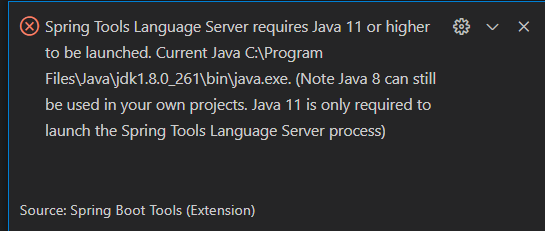
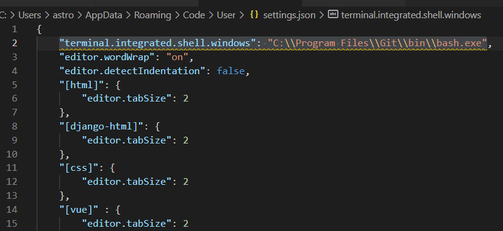

# VS code workspace Trust

> vs code를 실행시키니 아래와 같은 공지가 나왔다. 해당  workplace에 있는 모든 파일의 작성자를 신뢰하냐고 묻는 듯 하다. 전부 내가 작성한 거니 믿는다고 하자.
>
> - 신뢰할 수 없는 작성자라면 restricted mode로 folder를 browse
> - 제한된 모드? 코드 자동 실행이나 쓰기가 금지되는건가?


- Open source나 public repo같은 곳에서 받은 코드 중 자동으로 실행하는 코드를 막기 위해 restricted mode로 folder를 browse할 수 있음
- [tasks](#Tasks), debugging, workspace settings and extensions 같은 기능에 제한과 코드실행을 불가로 만듦


아래 항목은 세부 설정방법

### Tasks

### Debugging

### Workspace settings

### Extensions


[ VScode doc workspace trust](https://code.visualstudio.com/docs/editor/workspace-trust)


# Steam backup feature


[Steam backup feature](https://support.steampowered.com/kb_article.php?ref=8794-yphv-2033)


자소설 닷컴에서 수많은 유저의 자소서를 어떻게 관리하고 있을까, 또 어떤 식으로 저장하며 데이터 유실에 대한 예방책, 데이터 빠른 로드, 자소서가 삭제가 되는가? 

데이터 서버가 여러대 있다면 이것을 분산 처리할 수 있어야하겠죠?

분산 처리 

자소설닷컴 앱에서 채팅방을 새로 접속해야 채팅글이 업데이트됨 -> 불편함 '고쳐줘'

- 예전부터 궁금했던 점 : steam에서 게임을 다운받으면 용량이 게임용량의 2배정도는 필요한데 그 이유는 무엇일까???ㄴ
- 프로그램에서 해당 폴더의 경로에 대한 정보를 갖고 있으면 폴더명의 변경이 불가능한 점, 하지만 vscode는 된다. git bash도 좀 이상하지만 된다.
- 어떤 방식으로 이것을 하는 것일까???


# VS code spring boot

> 이전과 똑같은 문제 발생, 자바 버전이 달라서 생기는 것 같다.



- 그냥 단순히 java11이 pc에 설치되어 있지 않았다. 설치된 것은 java jdk11 adopt 버전인가 뭔가가 설치되어있었다. 이것이 java와 머가 다른지 모르겠다.


> default terminal을 다음과 같이 하는 걸 추천하는 거 같다.



- This is deprecated(비추), the new recommended way to configure your default shell is by creating a terminal profile in `#terminal.integrated.profiles.windows#` and setting its profile name as the default in `#terminal.integrated.defaultProfile.windows#`. This will currently take priority over the new profiles settings but that will change in the future.


- 알 수 없는 library를 import하면 maven repository로 가자, 웬만한 건 다 있다.


# [lombok 설치 및 @Slf4j 사용방법](https://oingdaddy.tistory.com/46)


- gradle 인데 slf4j에 `log`를 못 찾는다.

- dependency는 잘 설치했는데,  lombok plugin이라는 친구가 필요한 거 같다. intellij에서는 플러그인을 추가하면 된다고 한다. 
- vscode extensions에 lombok Annotations Support for vs code 머시기가 있었다. 그래서 설치함
- 설치하니까 interpreter의 밑줄은 사라졌는데, 에러는 남
- vscode lombok plugin 검색

- [lombok annotations Support for vs code 문서](https://projectlombok.org/setup/gradle)

- 아니 문서에 있는데로 1.18.20 썼는데, 1.18.10으로 수정하니까 됨

```
compileOnly 'org.projectlombok:lombok:1.18.10'
annotationProcessor 'org.projectlombok:lombok:1.18.10'
```

