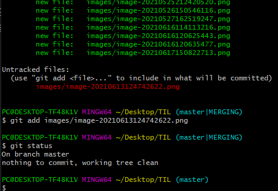

# GIT




- 내 예상과는 다르게 동작, untracked file 이 있길래 add 해주고... 아 그리고 전체 commit함 잘 못 생각했음
- merge가 잘 됨


## Python Deque in Colletions 

> remove(x) method가 어떤 방식으로 동작하는지 궁금해졌다. Double linked list로 구현되어 있을거라 예상되기 때문에 해당되는 데이터를 찾은 후 link를 끊고 이어주는게 아닌가 싶다.
>
> maxlen이라는 option이 있는 거로 아는데, 아마도 maxlen의 크기를 넘어서면 맨 앞에 거를 pop하고 맨 뒤에 push를 하는 방식으로 구현되어 있지 않을까 싶다. 

- Deques are a generalization of stacks and queues (the name is pronounced “deck” and is short for “double-ended queue”). Deques support thread-safe, memory efficient appends and pops from either side of the deque with approximately the same O(1) performance in either direction.

- If *maxlen* is not specified or is `None`, deques may grow to an arbitrary length. Otherwise, the deque is bounded to the specified maximum length. Once a bounded length deque is full, when new items are added, a corresponding number of items are discarded from the opposite end. Bounded length deques provide functionality similar to the `tail` filter in Unix. They are also useful for tracking transactions and other pools of data where only the most recent activity is of interest.

```python
class deque(MutableSequence[_T], Generic[_T]): # 멀티상속
    @property # decorator
    def maxlen(self) -> Optional[int]: ...
    def __init__(self, iterable: Iterable[_T] = ..., maxlen: Optional[int] = ...) -> None: ...
    def append(self, x: _T) -> None: ...
    def appendleft(self, x: _T) -> None: ...
    def clear(self) -> None: ...
    def copy(self) -> deque[_T]: ...
    def count(self, x: _T) -> int: ...
    def extend(self, iterable: Iterable[_T]) -> None: ...
    def extendleft(self, iterable: Iterable[_T]) -> None: ...
    def insert(self, i: int, x: _T) -> None: ...
    def index(self, x: _T, start: int = ..., stop: int = ...) -> int: ...
    def pop(self) -> _T: ...  # type: ignore
    def popleft(self) -> _T: ...
    def remove(self, value: _T) -> None: ...
    def reverse(self) -> None: ...
    def rotate(self, n: int = ...) -> None: ...
    def __len__(self) -> int: ...
    def __iter__(self) -> Iterator[_T]: ...
    def __str__(self) -> str: ...
    # These methods of deque don't really take slices, but we need to
    # define them as taking a slice to satisfy MutableSequence.
    @overload
    def __getitem__(self, index: int) -> _T: ...
    @overload
    def __getitem__(self, s: slice) -> MutableSequence[_T]: ...
    @overload
    def __setitem__(self, i: int, x: _T) -> None: ...
    @overload
    def __setitem__(self, s: slice, o: Iterable[_T]) -> None: ...
    @overload
    def __delitem__(self, i: int) -> None: ...
    @overload
    def __delitem__(self, s: slice) -> None: ...
    def __contains__(self, o: object) -> bool: ...
    def __reversed__(self) -> Iterator[_T]: ...
    def __iadd__(self: _S, iterable: Iterable[_T]) -> _S: ...
    def __add__(self, other: deque[_T]) -> deque[_T]: ...
    def __mul__(self, other: int) -> deque[_T]: ...
    def __imul__(self, other: int) -> None: ...
```

- 다 상속받아서 어디가 구현인지 모르겠다

- This one is implemented in C code for CPython, and the collections python module just [imports that name](https://github.com/python/cpython/blob/3.7/Lib/collections/__init__.py#L30). Depending on your Python version and installation, you may find somewhere on your system a file called `_collections.so` or `_collectionsmodule.so` which has the real implementation, but `inspect.getsource` is not really smart enough to figure that out.

  You can find the sources here:

  https://github.com/python/cpython/blob/3.7/Modules/_collectionsmodule.c

- Doubly linked list로 구현되어있다고 써있다.

```C
deque_remove(dequeobject *deque, PyObject *value) // value 받음
{
    Py_ssize_t i, n=Py_SIZE(deque); // Py_ssize_t? https://www.python.org/dev/peps/pep-0353/

    for (i=0 ; i<n ; i++) {
        PyObject *item = deque->leftblock->data[deque->leftindex];
        int cmp = PyObject_RichCompareBool(item, value, Py_EQ);

        if (Py_SIZE(deque) != n) {
            PyErr_SetString(PyExc_IndexError,
                "deque mutated during remove().");
            return NULL;
        }
        if (cmp > 0) {
            PyObject *tgt = deque_popleft(deque, NULL);
            assert (tgt != NULL);
            if (_deque_rotate(deque, i))
                return NULL;
            Py_DECREF(tgt);
            Py_RETURN_NONE;
        }
        else if (cmp < 0) {
            _deque_rotate(deque, i);
            return NULL;
        }
        _deque_rotate(deque, -1);
    }
    PyErr_SetString(PyExc_ValueError, "deque.remove(x): x not in deque");
    return NULL;
}
```


# Property vs. Getters and Setters in Python

In this tutorial, you will learn what the difference is between Python Property and Getters & Setters.

#### Table Of Contents

1. [What Are Getters And Setters](https://www.datacamp.com/community/tutorials/property-getters-setters?utm_source=adwords_ppc&utm_campaignid=1455363063&utm_adgroupid=65083631748&utm_device=c&utm_keyword=&utm_matchtype=b&utm_network=g&utm_adpostion=&utm_creative=332602034361&utm_targetid=aud-299261629574:dsa-429603003980&utm_loc_interest_ms=&utm_loc_physical_ms=1009871&gclid=Cj0KCQjw5auGBhDEARIsAFyNm9GyPWeYHpEFf9cYB44KF5ra4btidIqMH49lzE8hI0I2qDGazuI_QX0aAsAwEALw_wcB#WGS) 
2. [Private Attribute - Encapsulation](https://www.datacamp.com/community/tutorials/property-getters-setters?utm_source=adwords_ppc&utm_campaignid=1455363063&utm_adgroupid=65083631748&utm_device=c&utm_keyword=&utm_matchtype=b&utm_network=g&utm_adpostion=&utm_creative=332602034361&utm_targetid=aud-299261629574:dsa-429603003980&utm_loc_interest_ms=&utm_loc_physical_ms=1009871&gclid=Cj0KCQjw5auGBhDEARIsAFyNm9GyPWeYHpEFf9cYB44KF5ra4btidIqMH49lzE8hI0I2qDGazuI_QX0aAsAwEALw_wcB#PE) 
3. [Property](https://www.datacamp.com/community/tutorials/property-getters-setters?utm_source=adwords_ppc&utm_campaignid=1455363063&utm_adgroupid=65083631748&utm_device=c&utm_keyword=&utm_matchtype=b&utm_network=g&utm_adpostion=&utm_creative=332602034361&utm_targetid=aud-299261629574:dsa-429603003980&utm_loc_interest_ms=&utm_loc_physical_ms=1009871&gclid=Cj0KCQjw5auGBhDEARIsAFyNm9GyPWeYHpEFf9cYB44KF5ra4btidIqMH49lzE8hI0I2qDGazuI_QX0aAsAwEALw_wcB#property)


## 1. What Are Getters And Setters

- **Getters**:- These are the methods used in Object-Oriented Programming (OOPS) which helps to access the private attributes from a **class**.

- **Setters**:- These are the methods used in OOPS feature which helps to set the value to private attributes in a **class**.


[Hafeezul Kareem ShaikDecember 19th, 2018](https://www.datacamp.com/profile/hafeezulkareem)


## 3. Property

**@property** is used to get the value of a private attribute without using any **getter** methods. We have to put a line **@property** in front of the method where we return the private variable.

```python
class Property:

    def __init__(self, var):
        ## initializing the attribute
        self.a = var

    @property
    def a(self):
        return self.__a

    ## the attribute name and the method **name must be same** which is used to set the value for the attribute
    @a.setter
    def a(self, var):
        if var > 0 and var % 2 == 0:
            self.__a = var
        else:
            self.__a = 2
```


\__slots()__ ?