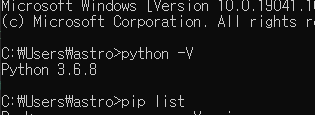
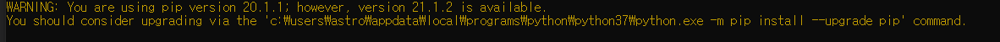

- reversed obj에 str()을 취해주면 객체를 string화 한다. \__str__로 추정

command 'python.execInTerminal-icon' not found

이건 또 무엇인가

Yes they solve my other errors related to VS Code but this particular error was in my folder from which I was running my python program because when I execute some other python program saved in some other directory it worked successfully.

vscode를 재실행하니 됨 extension을 실행하는데 문제가 있던것으로 추정

# Python 변수 범위(Scope) local,enclosed function local gloabl,Builtin

scope

# LEGB 규칙

 

"Flask" is not accessedPylance

Import "Flask" could not be resolvedPylance[reportMissingImports](https://github.com/microsoft/pylance-release/blob/main/DIAGNOSTIC_SEVERITY_RULES.md#diagnostic-severity-rules)

이 친구는 또 머야,  아마도 vscode extension에서 import 한 lib를 찾아주는게 아닌가 싶다.

Flask에 'Go to definition'을 하니 .vscode/ 아래에 있는 파일로 갔다.

왜 경로에 없다고 뜰까, python 3.6, 3.7, 3.8이 깔려 있다. vscode termnal 버전은 3.6.8이고 interpreter 역시 3.6.8이다. 그렇다면 실행하는 python의 버전이 다른 듯 하다. 근데 3.6으로 실행하고 있다.

기초적인 실수는 반복된다. 라이브러리 명으로 파일명 하지 말아라

하지만 3.6.8에서는 flask가 없다고 나온다

예상되는 바로는 pip list가  python 버전 별로 library를 표시해주는 것 같지 않다.

python -V는 3.6.8인데 python 37에서 pip를 업데이트 하라고 한다. 

위 경로를 python 36으로만 고쳐서 pip install을 하였다. 

default python이 3.7로 되어있는듯하다 -> 환경 변수 편집에서 찾아보니 `시스템 변수`는 37로 되어있었다. 그렇다면 왜 python -V는 3.6.8일까?  `pc에 대한 사용자 변수`는 36으로 되어있었다. ㅠㅠ

참고로 python library는 C:\Users\astro\AppData\Local\Programs\Python\Python36\Lib\site-packages 에 있다.

# Flask

> 선택 이유 : light 

Flask is a lightweight [WSGI](https://wsgi.readthedocs.io/) web application framework. It is designed to make getting started quick and easy, with the ability to scale up to complex applications. It began as a simple wrapper around [Werkzeug](https://werkzeug.palletsprojects.com/) and [Jinja](https://jinja.palletsprojects.com/) and has become one of the most popular Python web application frameworks.

myFlask를 만들어야함 어케???